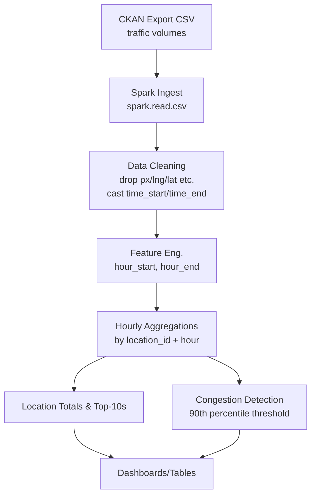
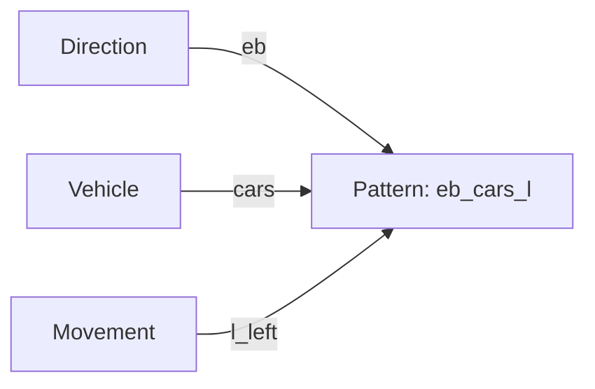
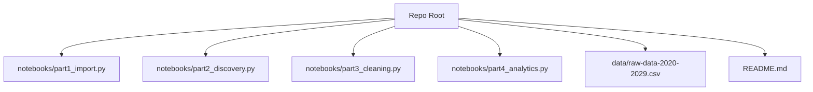
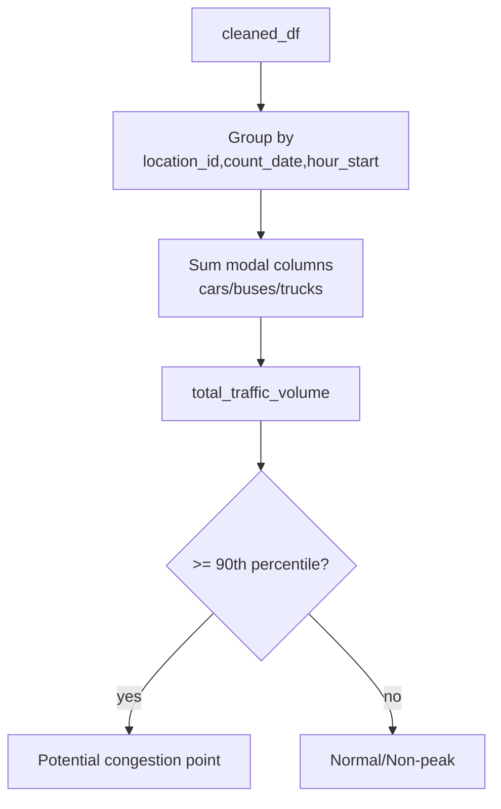
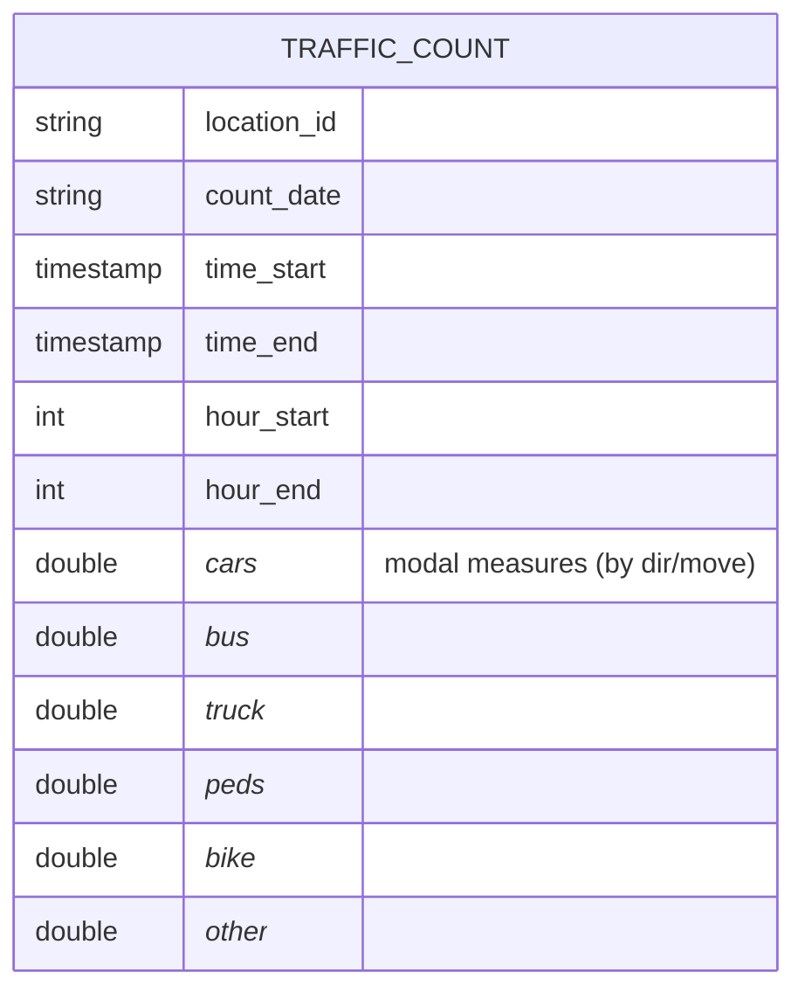

# API Project — City of Toronto Traffic Volumes (Databricks)

<p align="center">
  
</p>

A Databricks/Spark workflow to ingest, clean, and analyze the **Traffic volumes at intersections for all modes** dataset from Toronto Open Data. It computes hourly traffic by mode, compares locations, and flags potential congestion points.

> Source dataset: https://open.toronto.ca/dataset/traffic-volumes-at-intersections-for-all-modes/  
> Primary workspace path used: `/Volumes/workspace/default/ttc/raw-data-2020-2029.csv`

---

## Analysis Explained
https://github.com/AbdulRafay365/TTC-Traffic-Volume-and-Congestion-Management-with-Analytics-in-Databricks/releases/download/Video/TTC.Video.Presentation.mp4

[▶️ Watch Demo](https://github.com/AbdulRafay365/TTC-Traffic-Volume-and-Congestion-Management-with-Analytics-in-Databricks/raw/main/media/demo.mp4)
---

## TL;DR

- **Ingest** CSV from Toronto Open Data (CKAN export).  
- **Clean & enrich**: cast times, derive `hour_start`/`hour_end`, drop unused columns.  
- **Aggregate** by **hour** and **location**, then **sum by mode** (cars, buses, trucks).  
- **Analyze** top hours/locations & detect **high-volume** (90th percentile+) congestion candidates.

---

## Quickstart (Databricks)

1. **Cluster**: Spark 3.4+ (Databricks Runtime 13+), Python 3.10.
2. **Data**: Place the CSV at `/Volumes/workspace/default/ttc/raw-data-2020-2029.csv` or update the path in the notebook.
3. **Run notebooks** in this order:
   - Part 1 — Import (CSV → Spark DataFrame)
   - Part 2 — Discovery (schema & column semantics)
   - Part 3 — Cleaning (drop columns, cast timestamps, add hours)
   - Part 4 — Analytics (hourly, location totals, congestion scan)

---

## Pipeline at a Glance



---

## Column Semantics (Naming Pattern)

Columns follow a **direction · vehicle · movement** pattern:

- **Directions**: `wb` (westbound), `eb`, `sb`, `nb`  
- **Vehicles**: `cars`, `truck`, `bus`, `peds`, `bike`, `other`  
- **Movements**: `r` (right), `t` (through), `l` (left)

Example: `eb_cars_l` = **eastbound** **cars** turning **left**.



---

## Minimal Folder/Asset Map



---

## Core Steps & Code Hints

### 1) Import

```python
spark_df = (spark.read
            .option("header","true")
            .csv("/Volumes/workspace/default/ttc/raw-data-2020-2029.csv"))
display(spark_df)
```

### 2) Cleaning & Feature Engineering

- Drop low-value columns for this analysis (`px`, `lng`, `lat`, centerline metadata, etc.).  
- Cast `time_start`/`time_end` to timestamps; derive `hour_start`/`hour_end`.

```python
from pyspark.sql.functions import col, hour

columns_to_drop = ["nx_peds","sx_peds","ex_peds","wx_peds",
                   "nx_bike","sx_bike","ex_bike","wx_bike",
                   "nx_other","sx_other","ex_other","wx_other",
                   "px","lng","lat","centreline_type","centreline_id","_id","count_id"]

cleaned_df = (spark_df
  .drop(*columns_to_drop)
  .withColumn("time_start", col("time_start").cast("timestamp"))
  .withColumn("time_end",   col("time_end").cast("timestamp"))
  .withColumn("hour_start", hour(col("time_start")))
  .withColumn("hour_end",   hour(col("time_end"))))
```

### 3) Hourly Aggregations by Mode

```python
from pyspark.sql.functions import sum as s, col
from functools import reduce

car_cols   = [c for c in cleaned_df.columns if "_cars_"  in c]
bus_cols   = [c for c in cleaned_df.columns if "_bus_"   in c]
truck_cols = [c for c in cleaned_df.columns if "_truck_" in c]

def sum_columns(cols): 
    return reduce(lambda x,y: x+y, [col(c) for c in cols])

hourly_df = (cleaned_df
  .withColumn("hour", col("hour_start"))
  .groupBy("location_id","hour")
  .agg(*[s(col(c)).alias(c) for c in (car_cols + bus_cols + truck_cols)])
  .withColumn("total_cars",   sum_columns(car_cols))
  .withColumn("total_buses",  sum_columns(bus_cols))
  .withColumn("total_trucks", sum_columns(truck_cols))
  .select("location_id","hour","total_cars","total_buses","total_trucks"))
```

### 4) Location Comparisons & Top-10s

```python
loc_totals = (hourly_df.groupBy("hour")
  .agg(s("total_cars").alias("total_cars"),
       s("total_buses").alias("total_buses"),
       s("total_trucks").alias("total_trucks")))

top10_cars   = loc_totals.orderBy(col("total_cars").desc()).limit(10)
top10_buses  = loc_totals.orderBy(col("total_buses").desc()).limit(10)
top10_trucks = loc_totals.orderBy(col("total_trucks").desc()).limit(10)
```

### 5) Congestion Detection (Simple Heuristic)

- Build total per `location_id`/`count_date`/`hour_start`, then compute `total_traffic_volume`.  
- Flag hours ≥ **90th percentile** as potential congestion.

```python
from pyspark.sql.functions import col

hourly_traffic = (cleaned_df.groupBy("location_id","count_date","hour_start")
  .agg(s(col("eb_cars_l")).alias("total_cars"),
       s(col("eb_cars_r")).alias("total_buses"),
       s(col("eb_cars_t")).alias("total_trucks")))
hourly_traffic = hourly_traffic.withColumn(
    "total_traffic_volume", col("total_cars")+col("total_buses")+col("total_trucks")
)

p90 = hourly_traffic.approxQuantile("total_traffic_volume",[0.9],0.05)[0]
high_traffic = hourly_traffic.filter(col("total_traffic_volume") >= p90)
```

---

## Analytics Flow (What Happens)



---

## Data Model (Simplified)



> Note: Many modal fields exist (e.g., `eb_cars_l`, `wb_bus_t`). The analysis aggregates these into totals per mode/hour.

---

## Interpreting Results

- **Peak times** often align with **7–9 AM** and **4–6 PM** (commute windows).  
- **Top-10 tables** surface hours with the highest total by mode.  
- **High-volume flags** (≥ P90) mark candidate **congestion points** for deeper review (e.g., signal timing, turning lanes).

---

## Assumptions & Notes

- High number of **zeros** may reflect **off-peak measurements** or **data collection gaps**; treat cautiously.  
- Columns like `px`, geospatial fields, and centerline metadata are **dropped** for the current scope to focus on temporal/modal trends.  
- Thresholding via `approxQuantile` (P90) is a **simple heuristic**—tune as needed (e.g., P85/P95, rolling z-scores).

---

## Next Steps

- Join with **geospatial** data (keep `lat`/`lng`) for **map layers** and corridor rollups.  
- Build **heatmaps** (hour × location) and **weekday/weekend** comparisons.  
- Apply **seasonality** decomposition and **anomaly detection** (Prophet/ARIMA, moving IQR).  
- Publish **dashboards** (Databricks SQL, Power BI, Tableau).

---

## License & Attribution

- Data © City of Toronto, subject to its open data license.  
- Code snippets Apache-2.0 (or match your repo’s license).  

---

**Acknowledgements**: This README distills the Databricks notebook steps and findings for quick onboarding and reuse.
